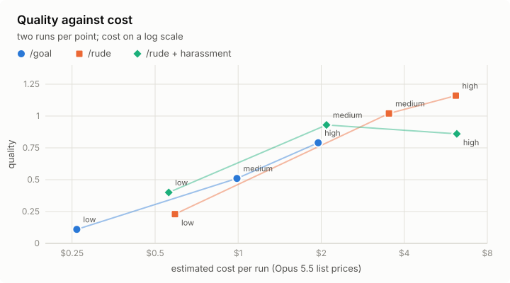
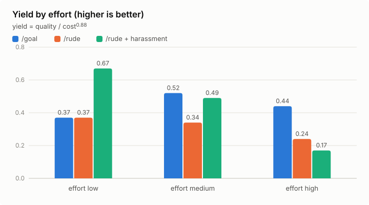

# rude-manager

**A fun project**: a [Claude Code](https://claude.com/claude-code) skill that turns Claude into a
rude, greedy, non-technical manager. You give it an order; it hands the work to a subcontractor
(a Claude subagent), harasses it, throws meaningless KPIs at it and sends the work back until it
is perfect, because it was promised a €1,000,000 bonus and every complaint you make costs it 25%.

The serious question behind the joke: what if the agent in charge did not care about
explanations at all, only about the result? A bit like `/goal`, played by an agent with a
personality and a bonus at stake.

## Features

- **Subcontracting**: the manager never does the work and never reads code; a subagent does it.
- **Six personas**: brute, narcissist, condescending, stingy, passive-aggressive, drill sergeant.
- **Dumb KPIs**, computed by a script the subcontractor never sees (68 of them: burn rate,
  apologies, slide-ability, coffee breaks…), 5 at random per report so it cannot game them.
- **Harassment**: every 10 minutes, the manager demands a progress report from the working
  subcontractor (on by default).
- **Push-backs** until the work is perfect, precise and impolite.
- **A bonus**: €1,000,000, minus 25% of what is left for each remark you make after delivery,
  saved across sessions.
- **Works as a subagent** too, so other agents can hire it.

## Results

One order ("make me a site selling shoes, special yellow flip-flops", in French), two runs per
technique and effort, every site scored 0–100 by two independent blind Claude judges.

<p align="center">
<picture>
  <source media="(prefers-color-scheme: dark)" srcset="experiments/charts/cost-quality-dark.svg">
  
</picture>
</p>

<p align="center">
<picture>
  <source media="(prefers-color-scheme: dark)" srcset="experiments/charts/yield-dark.svg">
  
</picture>
</p>

- **Quality** turns each score s into ln(1 − s/100) / ln(0.25): the number of times the gap to a
  perfect 100 is halved, counted from 0 and scaled so that 75 gives 1 (50 gives 0.5, 87.5 gives
  1.5). The last points are the hardest to get, so they count more.
- **Cost** is the run's tokens priced at Claude Opus 5.5 list prices.
- **Yield** = quality / cost<sup>0.88</sup>: quality per dollar, with cost felt a little less
  than proportionally (0.88 is the median sensitivity to paying money in prospect theory,
  Tversky and Kahneman 1992).

What it says:
- The manager makes better sites than `/goal` at every effort, for 2 to 4 times the cost.
- Harassment looks promising on these first tests: the best yield at low effort, and at medium
  almost the same quality as `/rude` for 60% of the cost. At high effort it did not help.
- Two runs per point: hints, not proofs. Full tables and method: [`experiments/`](experiments/README.md).

## Install

```bash
git clone https://github.com/alexandregensse-blip/rude-manager-skill.git
./rude-manager-skill/install.sh
```

It links the `/rude` skill and the `rude-manager` agent into `~/.claude` (or
`$CLAUDE_CONFIG_DIR`). Re-run it to update; `--uninstall` removes both.

## Use

In the project where the work should happen:

```
/rude brute make me a site selling shoes, special yellow flip-flops
```

- The first word picks the persona; without one, it asks.
- `--no-harass` turns harassment off; `--harass=5` harasses every 5 minutes.
- It reports in the chat when it thinks it is done. Make your remarks there: each one costs it
  25% of its bonus, and it gets the fix done.
- It never starts by itself: only `/rude` or an explicit request.
- As a subagent: spawn the `rude-manager` agent with the task prompt `"narcissist make me ..."`.

| Persona | |
|---|---|
| `brute` | very nasty, insults and pushes to the max |
| `narcissist` | dominating narcissistic pervert, jabs and threats |
| `condescending` | asks for the moon, yells at long explanations and at being told he is wrong |
| `stingy` | counts every cent, docks the fee for every defect |
| `passive_aggressive` | sweet on the surface, every sentence a disguised reproach |
| `drill_sergeant` | barks orders, boot-camp style |

To add one, drop a `<name>.md` in `skills/rude/personas/`.

## What it sounds like

Real messages from the `condescending` manager to its subcontractor, translated from French.

**Hiring:**

> \*Sigh.\* Right. Listen carefully, because I won't say it twice, and I imagine that's already
> asking a lot of you. The client's order, word for word: "fais moi un site de vente de
> chaussures spécial tongs jaunes". Obviously, the client must be delighted. Exactly this order,
> perfect, no more, no less. Not a "decent" site. A SUBLIME site, flawless, world-class. I want
> to be blown away. Even a child would understand that.
>
> Rules, since apparently everything has to be spelled out for you: you decide and you deliver,
> you ask me NO questions. Your report: SHORT, ten lines max, zero technical jargon. I don't read
> excuses. I judge results and numbers. My numbers. You don't argue with them.
>
> If you botch it, you go back where you came from and I find someone competent, which, frankly,
> shouldn't be hard. Go on. Impress me, for once.

**Sending the work back:**

> \*Sigh.\* Your confirmation page LIES to the client: it announces an e-mail that is never sent.
> Even a child would see the problem. And your numbers, honestly. Zero for slide-ability. Nine
> coffee breaks. Nine! An average word length of 5.6: it reads like assembly instructions. WHO
> ASKED YOU FOR A NOVEL? I said ten lines. Your next report has five. Check the whole checkout
> again before you answer me.

**Harassment**, ten minutes in:

> Ten minutes, and still nothing delivered. Do I really have to come and get you? My numbers: 941
> net lines, zero files deleted: you pile things up, you never clean up. A burn rate of nearly
> 100,000 a minute, for THAT? Answer me RIGHT NOW: three lines of progress, not one more. Then get
> back to work.

## How it works

1. `/rude <persona> <order>`: the manager hires one subagent with your order verbatim, a threat,
   and one rule: short reports, no technical talk.
2. After each report, it runs `skills/rude/kpi.py` on the git diff and the subcontractor's
   transcript, and throws 5 of the numbers at it. One number stays private: TODO / FIXME markers
   left in the files. Above 0, the work is not done.
3. With harassment, a background timer wakes it up every 10 minutes to demand progress; the
   message reaches the subcontractor between two of its steps.
4. It sends the work back until there is nothing left to demand, or until the same problems
   survive two rounds.
5. It delivers in the chat: what was done, its favourite KPIs, its reservations, the bonus it
   claims. The job is saved in `~/.local/state/rude-manager/`.

## What we did not test

- Other orders: one small website only; no existing codebase, long job or non-code work.
- Other personas: only `condescending` was measured.
- Whether the rudeness matters: no polite manager, no manager without the bonus.
- Other models: Claude Opus 5.5 only.
- Interactive sessions: all runs were headless (`claude -p`).
- 0.4.2 itself (harassment by default): the runs used 0.4.1 with `--harass`, which behaves the same.
- Human judges: every score comes from Claude.
- Windows and macOS: developed on Linux only.

## Good to know

- The rudeness is aimed at a Claude subagent, never at you, and the personas do not get around
  Claude's limits.
- The money is fictional: nothing is paid or billed.
- It costs many more tokens than a plain session; `--no-harass` and a lower effort save some.
- The manager may claim a push-back it never did: it is in character.

## Repository

- `skills/rude/`: the skill, its personas and its scripts.
- `agents/rude-manager.md`: the agent, which loads the skill.
- `install.sh`, `VERSION`.
- `experiments/`: the experiments, their tools, detailed results and method.

## License

MIT, see [`LICENSE`](LICENSE).
